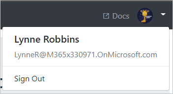

<!-- markdownlint-disable MD002 MD041 -->

<span data-ttu-id="b9dc3-101">Dans cet exercice, vous allez étendre l’application de l’exercice précédent pour prendre en charge l’authentification avec Azure AD.</span><span class="sxs-lookup"><span data-stu-id="b9dc3-101">In this exercise you will extend the application from the previous exercise to support authentication with Azure AD.</span></span> <span data-ttu-id="b9dc3-102">Cela est nécessaire pour obtenir le jeton d’accès OAuth nécessaire pour appeler Microsoft Graph.</span><span class="sxs-lookup"><span data-stu-id="b9dc3-102">This is required to obtain the necessary OAuth access token to call the Microsoft Graph.</span></span> <span data-ttu-id="b9dc3-103">Dans cette étape, vous allez intégrer la marque [omniauth-oauth2](https://github.com/omniauth/omniauth-oauth2) dans l’application et créer une stratégie omniauth personnalisée.</span><span class="sxs-lookup"><span data-stu-id="b9dc3-103">In this step you will integrate the [omniauth-oauth2](https://github.com/omniauth/omniauth-oauth2) gem into the application, and create a custom OmniAuth strategy.</span></span>

<span data-ttu-id="b9dc3-104">Tout d’abord, créez un fichier distinct pour conserver votre ID d’application et votre clé secrète.</span><span class="sxs-lookup"><span data-stu-id="b9dc3-104">First, create a separate file to hold your app ID and secret.</span></span> <span data-ttu-id="b9dc3-105">Créez un fichier appelé `oauth_environment_variables.rb` dans le `./config` dossier et ajoutez le code suivant.</span><span class="sxs-lookup"><span data-stu-id="b9dc3-105">Create a new file called `oauth_environment_variables.rb` in the `./config` folder, and add the following code.</span></span>

```ruby
ENV['AZURE_APP_ID'] = 'YOUR_APP_ID_HERE'
ENV['AZURE_APP_SECRET'] = 'YOUR_APP_SECRET_HERE'
ENV['AZURE_SCOPES'] = 'openid profile email offline_access user.read calendars.read'
```

<span data-ttu-id="b9dc3-106">Remplacez `YOUR_APP_ID_HERE` par l’ID de l’application dans le portail d’inscription de `YOUR_APP_SECRET_HERE` l’application et remplacez par le mot de passe que vous avez généré.</span><span class="sxs-lookup"><span data-stu-id="b9dc3-106">Replace `YOUR_APP_ID_HERE` with the application ID from the Application Registration Portal, and replace `YOUR_APP_SECRET_HERE` with the password you generated.</span></span>

> [!IMPORTANT]
> <span data-ttu-id="b9dc3-107">Si vous utilisez le contrôle de code source tel que git, il est maintenant recommandé d’exclure le `oauth_environment_variables.rb` fichier du contrôle de code source afin d’éviter une fuite accidentelle de votre ID d’application et de votre mot de passe.</span><span class="sxs-lookup"><span data-stu-id="b9dc3-107">If you're using source control such as git, now would be a good time to exclude the `oauth_environment_variables.rb` file from source control to avoid inadvertently leaking your app ID and password.</span></span>

<span data-ttu-id="b9dc3-108">À présent, ajoutez du code pour charger ce fichier s’il est présent.</span><span class="sxs-lookup"><span data-stu-id="b9dc3-108">Now add code to load this file if it's present.</span></span> <span data-ttu-id="b9dc3-109">Ouvrez le `./config/environment.rb` fichier et ajoutez le code suivant avant la `Rails.application.initialize!` ligne.</span><span class="sxs-lookup"><span data-stu-id="b9dc3-109">Open the `./config/environment.rb` file and add the following code before the `Rails.application.initialize!` line.</span></span>

```ruby
# Load OAuth settings
oauth_environment_variables = File.join(Rails.root, 'config', 'oauth_environment_variables.rb')
load(oauth_environment_variables) if File.exist?(oauth_environment_variables)
```

## <a name="setup-omniauth"></a><span data-ttu-id="b9dc3-110">Programme d’installation OmniAuth</span><span class="sxs-lookup"><span data-stu-id="b9dc3-110">Setup OmniAuth</span></span>

<span data-ttu-id="b9dc3-111">Vous avez déjà installé le `omniauth-oauth2` GEM, mais pour le faire fonctionner avec les points de terminaison OAuth Azure, vous devez [créer une stratégie OAuth2](https://github.com/omniauth/omniauth-oauth2#creating-an-oauth2-strategy).</span><span class="sxs-lookup"><span data-stu-id="b9dc3-111">You've already installed the `omniauth-oauth2` gem, but in order to make it work with the Azure OAuth endpoints, you need to [create an OAuth2 strategy](https://github.com/omniauth/omniauth-oauth2#creating-an-oauth2-strategy).</span></span> <span data-ttu-id="b9dc3-112">Il s’agit d’une classe Ruby qui définit les paramètres permettant de passer des demandes OAuth au fournisseur Azure.</span><span class="sxs-lookup"><span data-stu-id="b9dc3-112">This is a Ruby class that defines the parameters for making OAuth requests to the Azure provider.</span></span>

<span data-ttu-id="b9dc3-113">Créez un fichier appelé `microsoft_graph_auth.rb` dans le `./lib` dossier et ajoutez le code suivant.</span><span class="sxs-lookup"><span data-stu-id="b9dc3-113">Create a new file called `microsoft_graph_auth.rb` in the `./lib` folder, and add the following code.</span></span>

```ruby
require 'omniauth-oauth2'

module OmniAuth
  module Strategies
    # Implements an OmniAuth strategy to get a Microsoft Graph
    # compatible token from Azure AD
    class MicrosoftGraphAuth < OmniAuth::Strategies::OAuth2
      option :name, :microsoft_graph_auth

      DEFAULT_SCOPE = 'openid email profile User.Read'.freeze

      # Configure the Microsoft identity platform endpoints
      option  :client_options,
              site:          'https://login.microsoftonline.com',
              authorize_url: '/common/oauth2/v2.0/authorize',
              token_url:     '/common/oauth2/v2.0/token'

      # Send the scope parameter during authorize
      option :authorize_options, [:scope]

      # Unique ID for the user is the id field
      uid { raw_info['id'] }

      # Get additional information after token is retrieved
      extra do
        {
          'raw_info' => raw_info
        }
      end

      def raw_info
        # Get user profile information from the /me endpoint
        @raw_info ||= access_token.get('https://graph.microsoft.com/v1.0/me').parsed
      end

      def authorize_params
        super.tap do |params|
          params['scope'.to_sym] = request.params['scope'] if request.params['scope']
          params[:scope] ||= DEFAULT_SCOPE
        end
      end

      # Override callback URL
      # OmniAuth by default passes the entire URL of the callback, including
      # query parameters. Azure fails validation because that doesn't match the
      # registered callback.
      def callback_url
        options[:redirect_uri] || (full_host + script_name + callback_path)
      end
    end
  end
end
```

<span data-ttu-id="b9dc3-114">Prenez un moment pour examiner ce que fait ce code.</span><span class="sxs-lookup"><span data-stu-id="b9dc3-114">Take a moment to review what this code does.</span></span>

- <span data-ttu-id="b9dc3-115">Il définit le `client_options` pour spécifier les points de terminaison de la plateforme d’identité Microsoft.</span><span class="sxs-lookup"><span data-stu-id="b9dc3-115">It sets the `client_options` to specify the Microsoft identity platform endpoints.</span></span>
- <span data-ttu-id="b9dc3-116">Il spécifie que `scope` le paramètre doit être envoyé pendant la phase autoriser.</span><span class="sxs-lookup"><span data-stu-id="b9dc3-116">It specifies that the `scope` parameter should be sent during the authorize phase.</span></span>
- <span data-ttu-id="b9dc3-117">Il mappe la `id` propriété de l’utilisateur en tant qu’ID unique pour l’utilisateur.</span><span class="sxs-lookup"><span data-stu-id="b9dc3-117">It maps the `id` property of the user as the unique ID for the user.</span></span>
- <span data-ttu-id="b9dc3-118">Il utilise le jeton d’accès pour récupérer le profil de l’utilisateur à partir de Microsoft Graph `raw_info` pour remplir le hachage.</span><span class="sxs-lookup"><span data-stu-id="b9dc3-118">It uses the access token to retrieve the user's profile from Microsoft Graph to fill in the `raw_info` hash.</span></span>
- <span data-ttu-id="b9dc3-119">Il remplace l’URL de rappel pour s’assurer qu’elle correspond au rappel enregistré dans le portail d’inscription des applications.</span><span class="sxs-lookup"><span data-stu-id="b9dc3-119">It overrides the callback URL to ensure that it matches the registered callback in the app registration portal.</span></span>

<span data-ttu-id="b9dc3-120">À présent que nous avons défini la stratégie, nous devons configurer OmniAuth pour l’utiliser.</span><span class="sxs-lookup"><span data-stu-id="b9dc3-120">Now that we've defined the strategy, we need to configure OmniAuth to use it.</span></span> <span data-ttu-id="b9dc3-121">Créez un fichier appelé `omniauth_graph.rb` dans le `./config/initializers` dossier et ajoutez le code suivant.</span><span class="sxs-lookup"><span data-stu-id="b9dc3-121">Create a new file called `omniauth_graph.rb` in the `./config/initializers` folder, and add the following code.</span></span>

```ruby
require 'microsoft_graph_auth'

Rails.application.config.middleware.use OmniAuth::Builder do
  provider :microsoft_graph_auth,
           ENV['AZURE_APP_ID'],
           ENV['AZURE_APP_SECRET'],
           scope: ENV['AZURE_SCOPES']
end
```

<span data-ttu-id="b9dc3-122">Ce code s’exécute au démarrage de l’application.</span><span class="sxs-lookup"><span data-stu-id="b9dc3-122">This code will execute when the app starts.</span></span> <span data-ttu-id="b9dc3-123">Il charge le middleware OmniAuth avec le `microsoft_graph_auth` fournisseur, configuré avec les variables d’environnement définies dans. `oauth_environment_variables.rb`</span><span class="sxs-lookup"><span data-stu-id="b9dc3-123">It loads up the OmniAuth middleware with the `microsoft_graph_auth` provider, configured with the environment variables set in `oauth_environment_variables.rb`.</span></span>

## <a name="implement-sign-in"></a><span data-ttu-id="b9dc3-124">Mettre en œuvre la connexion</span><span class="sxs-lookup"><span data-stu-id="b9dc3-124">Implement sign-in</span></span>

<span data-ttu-id="b9dc3-125">Maintenant que l’intergiciel OmniAuth est configuré, vous pouvez passer à l’ajout d’une connexion à l’application.</span><span class="sxs-lookup"><span data-stu-id="b9dc3-125">Now that the OmniAuth middleware is configured, you can move on to adding sign-in to the app.</span></span> <span data-ttu-id="b9dc3-126">Exécutez la commande suivante dans votre interface CLI pour générer un contrôleur de connexion et de déconnexion.</span><span class="sxs-lookup"><span data-stu-id="b9dc3-126">Run the following command in your CLI to generate a controller for sign-in and sign-out.</span></span>

```Shell
rails generate controller Auth
```

<span data-ttu-id="b9dc3-127">Ouvrez le fichier `./app/controllers/auth_controller.rb`.</span><span class="sxs-lookup"><span data-stu-id="b9dc3-127">Open the `./app/controllers/auth_controller.rb` file.</span></span> <span data-ttu-id="b9dc3-128">Ajoutez une méthode de rappel à `AuthController` la classe.</span><span class="sxs-lookup"><span data-stu-id="b9dc3-128">Add a callback method to the `AuthController` class.</span></span> <span data-ttu-id="b9dc3-129">Cette méthode est appelée par le middleware OmniAuth une fois que le flux OAuth est terminé.</span><span class="sxs-lookup"><span data-stu-id="b9dc3-129">This method will be called by the OmniAuth middleware once the OAuth flow is complete.</span></span>

```ruby
def callback
  # Access the authentication hash for omniauth
  data = request.env['omniauth.auth']

  # Temporary for testing!
  render json: data.to_json
end
```

<span data-ttu-id="b9dc3-130">Pour l’instant, tout ceci est rendu le hachage fourni par OmniAuth.</span><span class="sxs-lookup"><span data-stu-id="b9dc3-130">For now all this does is render the hash provided by OmniAuth.</span></span> <span data-ttu-id="b9dc3-131">Nous allons l’utiliser pour vérifier que notre connexion fonctionne avant de poursuivre.</span><span class="sxs-lookup"><span data-stu-id="b9dc3-131">We'll use this to verify that our sign-in is working before moving on.</span></span> <span data-ttu-id="b9dc3-132">Avant de tester, nous devons ajouter les itinéraires à `./config/routes.rb`.</span><span class="sxs-lookup"><span data-stu-id="b9dc3-132">Before we test, we need to add the routes to `./config/routes.rb`.</span></span>

```ruby
# Add route for OmniAuth callback
match '/auth/:provider/callback', to: 'auth#callback', via: [:get, :post]
```

<span data-ttu-id="b9dc3-133">Maintenant, mettez à jour les affichages pour vous connecter.</span><span class="sxs-lookup"><span data-stu-id="b9dc3-133">Now update the views to sign in.</span></span> <span data-ttu-id="b9dc3-134">Ouvrez `./app/views/layouts/application.html.erb`.</span><span class="sxs-lookup"><span data-stu-id="b9dc3-134">Open `./app/views/layouts/application.html.erb`.</span></span> <span data-ttu-id="b9dc3-135">Remplacez la ligne `<a href="#" class="nav-link">Sign In</a>` par ce qui suit.</span><span class="sxs-lookup"><span data-stu-id="b9dc3-135">Replace the line `<a href="#" class="nav-link">Sign In</a>` with the following.</span></span>

```html
<%= link_to "Click here to sign in", "/auth/microsoft_graph_auth", method: :post, class: "nav-link" %>
```

<span data-ttu-id="b9dc3-136">Ouvrez le `./app/views/home/index.html.erb` fichier et remplacez la `<a href="#" class="btn btn-primary btn-large">Click here to sign in</a>` ligne par ce qui suit.</span><span class="sxs-lookup"><span data-stu-id="b9dc3-136">Open the `./app/views/home/index.html.erb` file and replace the `<a href="#" class="btn btn-primary btn-large">Click here to sign in</a>` line with the following.</span></span>

```html
<%= link_to "Click here to sign in", "/auth/microsoft_graph_auth", method: :post, class: "btn btn-primary btn-large" %>
```

<span data-ttu-id="b9dc3-137">Démarrez le serveur et accédez à `https://localhost:3000`.</span><span class="sxs-lookup"><span data-stu-id="b9dc3-137">Start the server and browse to `https://localhost:3000`.</span></span> <span data-ttu-id="b9dc3-138">Cliquez sur le bouton de connexion et vous devez être redirigé vers `https://login.microsoftonline.com`.</span><span class="sxs-lookup"><span data-stu-id="b9dc3-138">Click the sign-in button and you should be redirected to `https://login.microsoftonline.com`.</span></span> <span data-ttu-id="b9dc3-139">Connectez-vous avec votre compte Microsoft et acceptez les autorisations demandées.</span><span class="sxs-lookup"><span data-stu-id="b9dc3-139">Login with your Microsoft account and consent to the requested permissions.</span></span> <span data-ttu-id="b9dc3-140">Le navigateur redirige vers l’application en affichant le hachage généré par OmniAuth.</span><span class="sxs-lookup"><span data-stu-id="b9dc3-140">The browser redirects to the app, showing the hash generated by OmniAuth.</span></span>

```json
{
  "provider": "microsoft_graph_auth",
  "uid": "eb52b3b2-c4ac-4b4f-bacd-d5f7ece55df0",
  "info": {
    "name": null
  },
  "credentials": {
    "token": "eyJ0eXAi...",
    "refresh_token": "OAQABAAA...",
    "expires_at": 1529517383,
    "expires": true
  },
  "extra": {
    "raw_info": {
      "@odata.context": "https://graph.microsoft.com/v1.0/$metadata#users/$entity",
      "id": "eb52b3b2-c4ac-4b4f-bacd-d5f7ece55df0",
      "businessPhones": [
        "+1 425 555 0109"
      ],
      "displayName": "Adele Vance",
      "givenName": "Adele",
      "jobTitle": "Retail Manager",
      "mail": "AdeleV@contoso.onmicrosoft.com",
      "mobilePhone": null,
      "officeLocation": "18/2111",
      "preferredLanguage": "en-US",
      "surname": "Vance",
      "userPrincipalName": "AdeleV@contoso.onmicrosoft.com"
    }
  }
}
```

## <a name="storing-the-tokens"></a><span data-ttu-id="b9dc3-141">Stockage des jetons</span><span class="sxs-lookup"><span data-stu-id="b9dc3-141">Storing the tokens</span></span>

<span data-ttu-id="b9dc3-142">Maintenant que vous pouvez obtenir des jetons, il est temps de mettre en œuvre un moyen de les stocker dans l’application.</span><span class="sxs-lookup"><span data-stu-id="b9dc3-142">Now that you can get tokens, it's time to implement a way to store them in the app.</span></span> <span data-ttu-id="b9dc3-143">Étant donné qu’il s’agit d’un exemple d’application, pour des raisons de simplicité, vous les stockerez dans la session.</span><span class="sxs-lookup"><span data-stu-id="b9dc3-143">Since this is a sample app, for simplicity's sake, you'll store them in the session.</span></span> <span data-ttu-id="b9dc3-144">Une application réelle utiliserait une solution de stockage sécurisé plus fiable, comme une base de données.</span><span class="sxs-lookup"><span data-stu-id="b9dc3-144">A real-world app would use a more reliable secure storage solution, like a database.</span></span>

<span data-ttu-id="b9dc3-145">Ouvrez le fichier `./app/controllers/application_controller.rb`.</span><span class="sxs-lookup"><span data-stu-id="b9dc3-145">Open the `./app/controllers/application_controller.rb` file.</span></span> <span data-ttu-id="b9dc3-146">Vous allez ajouter toutes nos méthodes de gestion des jetons ici.</span><span class="sxs-lookup"><span data-stu-id="b9dc3-146">You'll add all of our token management methods here.</span></span> <span data-ttu-id="b9dc3-147">Étant donné que tous les autres contrôleurs `ApplicationController` héritent de la classe, ils seront en mesure d’utiliser ces méthodes pour accéder aux jetons.</span><span class="sxs-lookup"><span data-stu-id="b9dc3-147">Because all of the other controllers inherit the `ApplicationController` class, they'll be able to use these methods to access the tokens.</span></span>

<span data-ttu-id="b9dc3-148">Ajoutez la méthode suivante à la classe `ApplicationController`.</span><span class="sxs-lookup"><span data-stu-id="b9dc3-148">Add the following method to the `ApplicationController` class.</span></span> <span data-ttu-id="b9dc3-149">La méthode prend le hachage OmniAuth en tant que paramètre et extrait les bits pertinents des informations, puis il les stocke dans la session.</span><span class="sxs-lookup"><span data-stu-id="b9dc3-149">The method takes the OmniAuth hash as a parameter and extracts the relevant bits of information, then stores that in the session.</span></span>

```ruby
def save_in_session(auth_hash)
  # Save the token info
  session[:graph_token_hash] = auth_hash.dig(:credentials)
  # Save the user's display name
  session[:user_name] = auth_hash.dig(:extra, :raw_info, :displayName)
  # Save the user's email address
  # Use the mail field first. If that's empty, fall back on
  # userPrincipalName
  session[:user_email] = auth_hash.dig(:extra, :raw_info, :mail) ||
                         auth_hash.dig(:extra, :raw_info, :userPrincipalName)
end
```

<span data-ttu-id="b9dc3-150">À présent, ajoutez des fonctions d’accès pour récupérer le nom d’utilisateur, l’adresse de messagerie et le jeton d’accès en dehors de la session.</span><span class="sxs-lookup"><span data-stu-id="b9dc3-150">Now add accessor functions to retrieve the user name, email address, and access token back out of the session.</span></span>

```ruby
def user_name
  session[:user_name]
end

def user_email
  session[:user_email]
end

def access_token
  session[:graph_token_hash][:token]
end
```

<span data-ttu-id="b9dc3-151">Enfin, ajoutez du code qui s’exécutera avant le traitement d’une action.</span><span class="sxs-lookup"><span data-stu-id="b9dc3-151">Finally, add some code that will run before any action is processed.</span></span>

```ruby
before_action :set_user

def set_user
  @user_name = user_name
  @user_email = user_email
end
```

<span data-ttu-id="b9dc3-152">Cette méthode définit les variables utilisées par la disposition ( `application.html.erb`en) pour afficher les informations de l’utilisateur dans la barre de navigation.</span><span class="sxs-lookup"><span data-stu-id="b9dc3-152">This method sets the variables that the layout (in `application.html.erb`) uses to show the user's information in the nav bar.</span></span> <span data-ttu-id="b9dc3-153">En l’ajoutant ici, il n’est pas nécessaire d’ajouter ce code dans chaque action de contrôleur.</span><span class="sxs-lookup"><span data-stu-id="b9dc3-153">By adding it here, you don't have to add this code in every single controller action.</span></span> <span data-ttu-id="b9dc3-154">Toutefois, cette opération s’exécute également pour les actions `AuthController`dans le, ce qui n’est pas optimal.</span><span class="sxs-lookup"><span data-stu-id="b9dc3-154">However, this will also run for actions in the `AuthController`, which isn't optimal.</span></span> <span data-ttu-id="b9dc3-155">Ajoutez le code suivant à la `AuthController` classe dans `./app/controllers/auth_controller.rb` pour ignorer l’action avant.</span><span class="sxs-lookup"><span data-stu-id="b9dc3-155">Add the following code to the `AuthController` class in `./app/controllers/auth_controller.rb` to skip the before action.</span></span>

```ruby
skip_before_action :set_user
```

<span data-ttu-id="b9dc3-156">Ensuite, mettez à `callback` jour la fonction `AuthController` dans la classe pour stocker les jetons dans la session et rediriger vers la page principale.</span><span class="sxs-lookup"><span data-stu-id="b9dc3-156">Then, update the `callback` function in the `AuthController` class to store the tokens in the session and redirect back to the main page.</span></span> <span data-ttu-id="b9dc3-157">Remplacez la fonction `callback` existante par ce qui suit.</span><span class="sxs-lookup"><span data-stu-id="b9dc3-157">Replace the existing `callback` function with the following.</span></span>

```ruby
def callback
  # Access the authentication hash for omniauth
  data = request.env['omniauth.auth']

  # Save the data in the session
  save_in_session data

  redirect_to root_url
end
```

## <a name="implement-sign-out"></a><span data-ttu-id="b9dc3-158">Mettre en œuvre la déconnexion</span><span class="sxs-lookup"><span data-stu-id="b9dc3-158">Implement sign-out</span></span>

<span data-ttu-id="b9dc3-159">Avant de tester cette nouvelle fonctionnalité, ajoutez une méthode pour vous déconnecter. Ajoutez l’action suivante à la `AuthController` classe.</span><span class="sxs-lookup"><span data-stu-id="b9dc3-159">Before you test this new feature, add a way to sign out. Add the following action to the `AuthController` class.</span></span>

```ruby
def signout
  reset_session
  redirect_to root_url
end
```

<span data-ttu-id="b9dc3-160">Ajoutez cette action à `./config/routes.rb`.</span><span class="sxs-lookup"><span data-stu-id="b9dc3-160">Add this action to `./config/routes.rb`.</span></span>

```ruby
get 'auth/signout'
```

<span data-ttu-id="b9dc3-161">Maintenant, mettez à jour l’affichage `signout` pour utiliser l’action.</span><span class="sxs-lookup"><span data-stu-id="b9dc3-161">Now update the view to use the `signout` action.</span></span> <span data-ttu-id="b9dc3-162">Ouvrez `./app/views/layouts/application.html.erb`.</span><span class="sxs-lookup"><span data-stu-id="b9dc3-162">Open `./app/views/layouts/application.html.erb`.</span></span> <span data-ttu-id="b9dc3-163">Remplacez la ligne `<a href="#" class="dropdown-item">Sign Out</a>` par :</span><span class="sxs-lookup"><span data-stu-id="b9dc3-163">Replace the line `<a href="#" class="dropdown-item">Sign Out</a>` with:</span></span>

```html
<%= link_to "Sign Out", {:controller => :auth, :action => :signout}, :class => "dropdown-item" %>
```

<span data-ttu-id="b9dc3-164">Redémarrez le serveur et suivez le processus de connexion.</span><span class="sxs-lookup"><span data-stu-id="b9dc3-164">Restart the server and go through the sign-in process.</span></span> <span data-ttu-id="b9dc3-165">Vous devez revenir sur la page d’accueil, mais l’interface utilisateur doit changer pour indiquer que vous êtes connecté.</span><span class="sxs-lookup"><span data-stu-id="b9dc3-165">You should end up back on the home page, but the UI should change to indicate that you are signed-in.</span></span>


<span data-ttu-id="b9dc3-167">Cliquez sur Avatar de l’utilisateur dans le coin supérieur droit pour accéder au lien **déconnexion** .</span><span class="sxs-lookup"><span data-stu-id="b9dc3-167">Click the user avatar in the top right corner to access the **Sign Out** link.</span></span> <span data-ttu-id="b9dc3-168">Cliquez sur **déconnexion** pour réinitialiser la session et revenir à la page d’accueil.</span><span class="sxs-lookup"><span data-stu-id="b9dc3-168">Clicking **Sign Out** resets the session and returns you to the home page.</span></span>



## <a name="refreshing-tokens"></a><span data-ttu-id="b9dc3-170">Actualisation des jetons</span><span class="sxs-lookup"><span data-stu-id="b9dc3-170">Refreshing tokens</span></span>

<span data-ttu-id="b9dc3-171">Si vous examinez attentivement le hachage généré par OmniAuth, vous remarquerez qu’il y a deux jetons dans le `token` hachage `refresh_token`: et.</span><span class="sxs-lookup"><span data-stu-id="b9dc3-171">If you look closely at the hash generated by OmniAuth, you'll notice there are two tokens in the hash: `token` and `refresh_token`.</span></span> <span data-ttu-id="b9dc3-172">La valeur dans `token` est le jeton d’accès, qui est envoyé dans `Authorization` l’en-tête des appels d’API.</span><span class="sxs-lookup"><span data-stu-id="b9dc3-172">The value in `token` is the access token, which is sent in the `Authorization` header of API calls.</span></span> <span data-ttu-id="b9dc3-173">Il s’agit du jeton qui permet à l’application d’accéder à Microsoft Graph pour le compte de l’utilisateur.</span><span class="sxs-lookup"><span data-stu-id="b9dc3-173">This is the token that allows the app to access the Microsoft Graph on the user's behalf.</span></span>

<span data-ttu-id="b9dc3-174">Toutefois, ce jeton est éphémère.</span><span class="sxs-lookup"><span data-stu-id="b9dc3-174">However, this token is short-lived.</span></span> <span data-ttu-id="b9dc3-175">Le jeton expire une heure après son émission.</span><span class="sxs-lookup"><span data-stu-id="b9dc3-175">The token expires an hour after it is issued.</span></span> <span data-ttu-id="b9dc3-176">C’est ici que `refresh_token` la valeur devient utile.</span><span class="sxs-lookup"><span data-stu-id="b9dc3-176">This is where the `refresh_token` value becomes useful.</span></span> <span data-ttu-id="b9dc3-177">Le jeton d’actualisation permet à l’application de demander un nouveau jeton d’accès sans demander à l’utilisateur de se reconnecter.</span><span class="sxs-lookup"><span data-stu-id="b9dc3-177">The refresh token allows the app to request a new access token without requiring the user to sign in again.</span></span> <span data-ttu-id="b9dc3-178">Mettez à jour le code de gestion des jetons pour implémenter l’actualisation des jetons.</span><span class="sxs-lookup"><span data-stu-id="b9dc3-178">Update the token management code to implement token refresh.</span></span>

<span data-ttu-id="b9dc3-179">Ouvrez `./app/controllers/application_controller.rb` et ajoutez les instructions `require` suivantes en haut :</span><span class="sxs-lookup"><span data-stu-id="b9dc3-179">Open `./app/controllers/application_controller.rb` and add the following `require` statements at the top:</span></span>

```ruby
require 'microsoft_graph_auth'
require 'oauth2'
```

<span data-ttu-id="b9dc3-180">Ajoutez ensuite la méthode suivante à la `ApplicationController` classe.</span><span class="sxs-lookup"><span data-stu-id="b9dc3-180">Then add the following method to the `ApplicationController` class.</span></span>

```ruby
def refresh_tokens(token_hash)
  oauth_strategy = OmniAuth::Strategies::MicrosoftGraphAuth.new(
    nil, ENV['AZURE_APP_ID'], ENV['AZURE_APP_SECRET']
  )

  token = OAuth2::AccessToken.new(
    oauth_strategy.client, token_hash[:token],
    refresh_token: token_hash[:refresh_token]
  )

  # Refresh the tokens
  new_tokens = token.refresh!.to_hash.slice(:access_token, :refresh_token, :expires_at)

  # Rename token key
  new_tokens[:token] = new_tokens.delete :access_token

  # Store the new hash
  session[:graph_token_hash] = new_tokens
end
```

<span data-ttu-id="b9dc3-181">Cette méthode utilise la marque [oauth2](https://github.com/oauth-xx/oauth2) (une dépendance de la `omniauth-oauth2` gemme) pour actualiser les jetons et met à jour la session.</span><span class="sxs-lookup"><span data-stu-id="b9dc3-181">This method uses the [oauth2](https://github.com/oauth-xx/oauth2) gem (a dependency of the `omniauth-oauth2` gem) to refresh the tokens, and updates the session.</span></span>

<span data-ttu-id="b9dc3-182">Maintenant, cette méthode doit être utilisée.</span><span class="sxs-lookup"><span data-stu-id="b9dc3-182">Now put this method to use.</span></span> <span data-ttu-id="b9dc3-183">Pour ce faire, rendez `access_token` l’accesseur `ApplicationController` de la classe un peu plus intelligent.</span><span class="sxs-lookup"><span data-stu-id="b9dc3-183">To do that, make the `access_token` accessor in the `ApplicationController` class a bit smarter.</span></span> <span data-ttu-id="b9dc3-184">Au lieu de simplement renvoyer le jeton de la session, il commence par vérifier s’il est proche de la date d’expiration.</span><span class="sxs-lookup"><span data-stu-id="b9dc3-184">Instead of just returning the token from the session, it will first check if it is close to expiration.</span></span> <span data-ttu-id="b9dc3-185">Si c’est le cas, il est actualisé avant de renvoyer le jeton.</span><span class="sxs-lookup"><span data-stu-id="b9dc3-185">If it is, then it will refresh before returning the token.</span></span> <span data-ttu-id="b9dc3-186">Remplacez la méthode `access_token` actuelle par ce qui suit.</span><span class="sxs-lookup"><span data-stu-id="b9dc3-186">Replace the current `access_token` method with the following.</span></span>

```ruby
def access_token
  token_hash = session[:graph_token_hash]

  # Get the expiry time - 5 minutes
  expiry = Time.at(token_hash[:expires_at] - 300)

  if Time.now > expiry
    # Token expired, refresh
    new_hash = refresh_tokens token_hash
    new_hash[:token]
  else
    token_hash[:token]
  end
end
```
